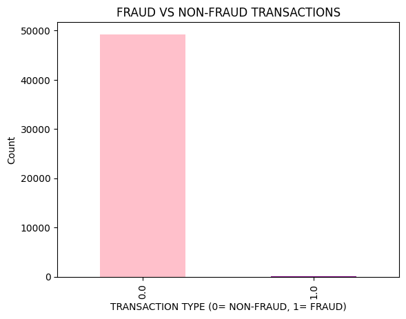
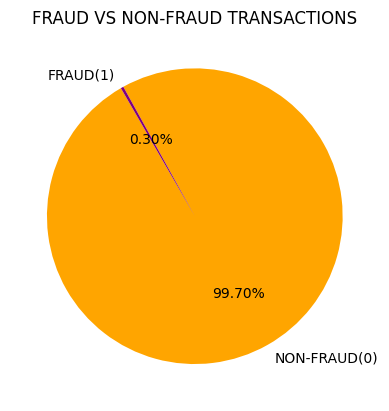

# Credit Card Fraud Detection (Data Cleaning Project)

## 📌 Project Overview
This project focuses on **exploring and cleaning a credit card fraud dataset**.  
The dataset contains anonymized transaction details with labels indicating whether a transaction was fraudulent.  

The goal is to prepare the dataset for further analysis, build initial **visual insights**, and lay the groundwork for future machine learning models.

---

## 📊 Key Steps
- **Data Cleaning**  
  - Loaded and explored dataset using **Pandas/Numpy**  
  - Checked missing values and data distributions  
  - Saved a cleaned version of the dataset  

- **Data Visualization**  
  - Fraud vs Non-Fraud **Bar Chart**  
  - Fraud vs Non-Fraud **Pie Chart**

- **Outputs**  
  - `Cleaned_ccfraud.csv` → Cleaned dataset  
  - `fraud_bar.png` → Bar chart  
  - `fraud_pie.png` → Pie chart  

---

## 📸 Visualizations

### Fraud vs Non-Fraud (Bar Chart)

### Fraud vs Non-Fraud (Pie Chart)

---

## 🚀 Tools Used
- Python (Pandas, Numpy, Matplotlib)  
- Google Colab  
- GitHub for project hosting  

---

## 🔮 Next Steps
- Build **interactive dashboards** with Tableau/Power BI  
- Train a **Machine Learning Model** for fraud detection  
- Explore applications in **finance and petroleum sectors**  

---

## 📂 Repository Structure
creditcard-fraud-analysis/

│── Untitled1 (1).ipynb   # Jupyter Notebook  
│── Cleaned_ccfraud.csv      # Cleaned dataset  
│── fraud_bar.png             # Fraud vs Non-Fraud bar chart  
│── fraud_pie.png             # Fraud vs Non-Fraud pie chart  
│── README.md                 # Project overview (this file)  
